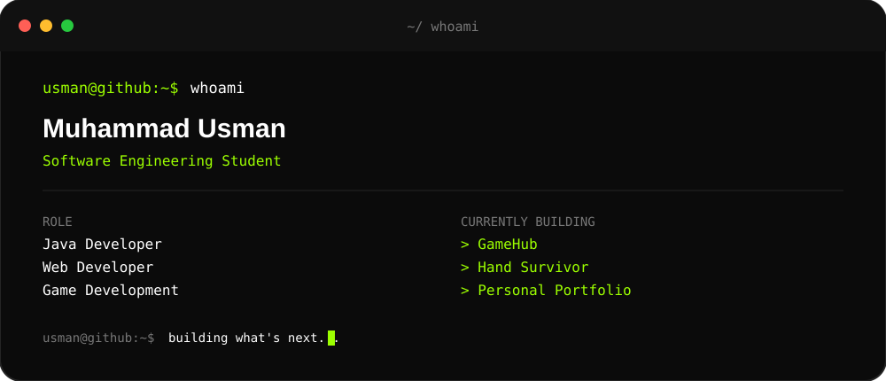
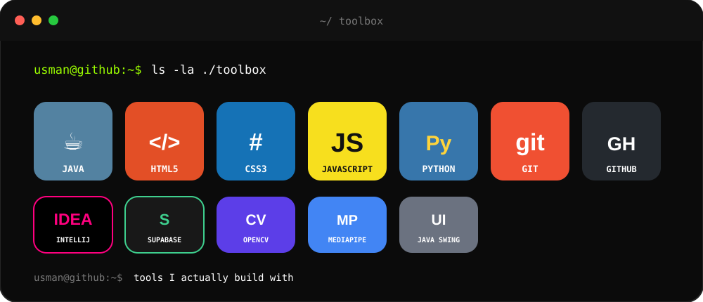

 

<h1>MUHAMMAD USMAN</h1>

<code>@usmanwith1s</code>

Software Engineering Student · Java Developer · Web Developer · Game Development Enthusiast

  

<table>
<tr>

<td>

</td>

<td>

</td>

<td>

</td>

</tr>
</table>

 

 

